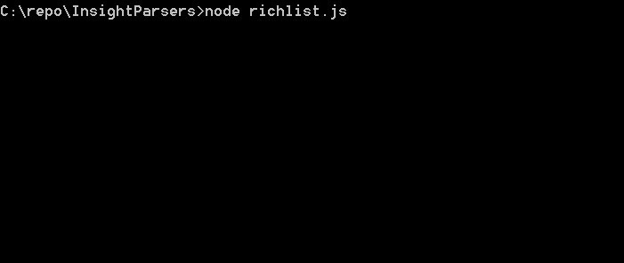
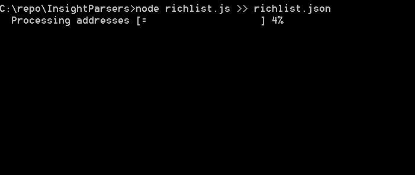

# InsightParsers
Various scripts to parse the databases created by Insight and Insight-API

Drop these js files into your ~/.insight/txs/ directory
Pipe the results to a file like this:

```
node alltx.js > ~/insight/public/alltx.json
```
The above command will create your results here: 
```
http://yourinsightaddress.ext/alltx.json
```

alltx.js parses out every transaction with a positive value and sorts it by the value

allseen.tx parses out every address / transaction seen on the blockchain (including zero currency tx's)

## Richlist
This script will take the output from allseen.js (in the case of the example that's allseen.json) and product an object that's sorted by highest balance first with addresses that have zero balances removed. By default the output is dumped to the console. 



But a simple pipe can redirect the output to a file. 


